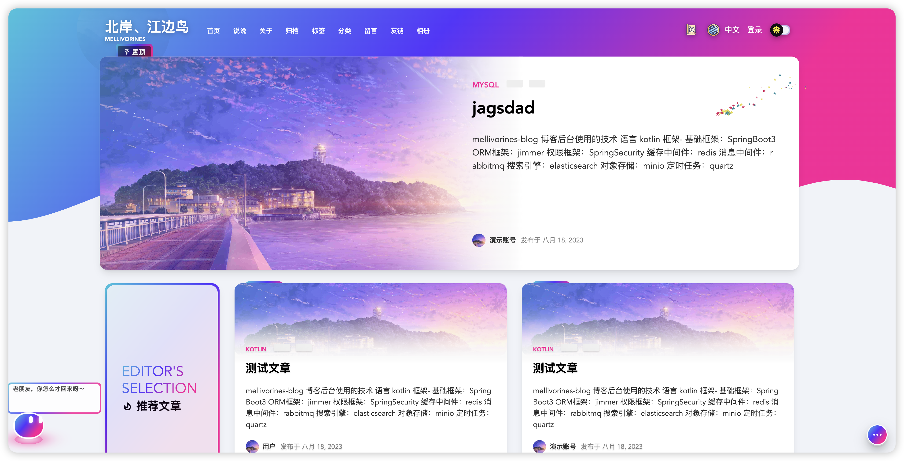
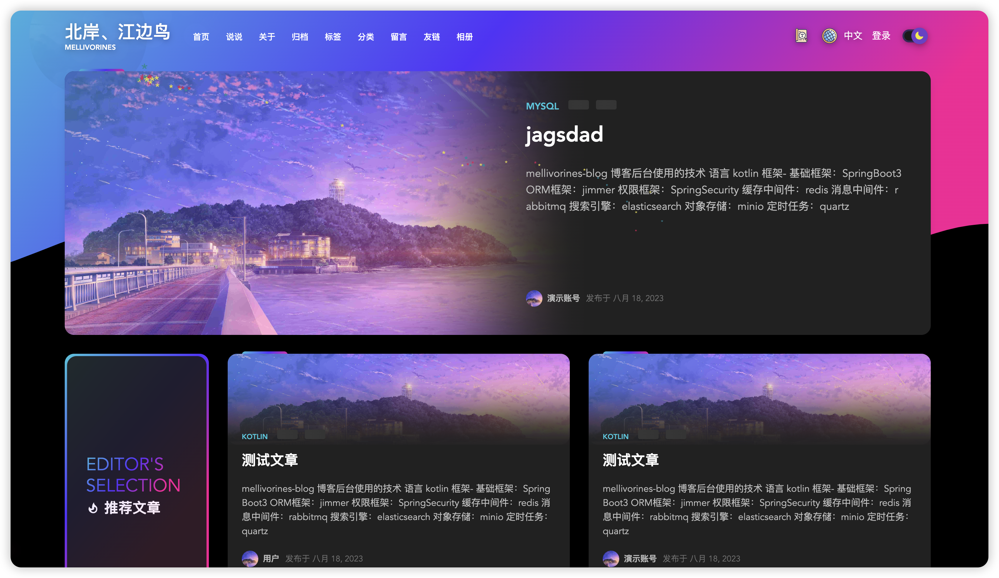

# mellivorines-bog---前后端分离博客

## 前言

- 开源不易，希望大家star支持一下
- 由于本人上班，空余时间不固定，所以项目更新频率较慢，但是本项目会长期维护，有问题可以提issue，
  同时也欢迎大家来共建此项目，包括但不限于：bug 修复、代码优化、功能开发等等
- 本项目后端是kotlin配合springboot3对jimmer的一个实验项目，基于[linhaojun857](https://github.com/linhaojun857)的[aurora](https://github.com/linhaojun857/aurora)博客重构

## 效果图

### 白色主题：

### 黑色主题：

## 相关技术

### 前端：

- 样式来自于：[hexo的aurora主题](https://github.com/auroral-ui/hexo-theme-aurora)
- 基础框架：vue3(前台) vue2(后台)
- 状态管理：pinia(前台) vuex(后台)
- 路由组件：vue-router
- 网络请求：axios
- 其他技术：详见前端项目的package.json

### 后端：
- 语言：kotlin
- 基础框架：SpringBoot3
- ORM框架：[jimmer](https://github.com/babyfish-ct/jimmer)
- 权限框架：SpringSecurity
- 缓存中间件：redis
- 消息中间件：rabbitmq
- 搜索引擎：elasticsearch
- 对象存储：minio
- 定时任务：quartz
- 其他技术：详见后端项目的build.gradle.kts

## 参考的技术文档
- jimmer:https://babyfish-ct.gitee.io/jimmer-doc/

## 后续计划

- [ ] 前台代码优化
- [ ] 后台vue3重构
- [ ] 后端提供轻量化选择

## 部署

- 详见项目部署文档

## 鸣谢

- 感谢[linhaojun857](https://github.com/linhaojun857)开源前后端博客
- 感谢[babyfish](https://github.com/babyfish-ct/jimmer)开源的强大orm框架